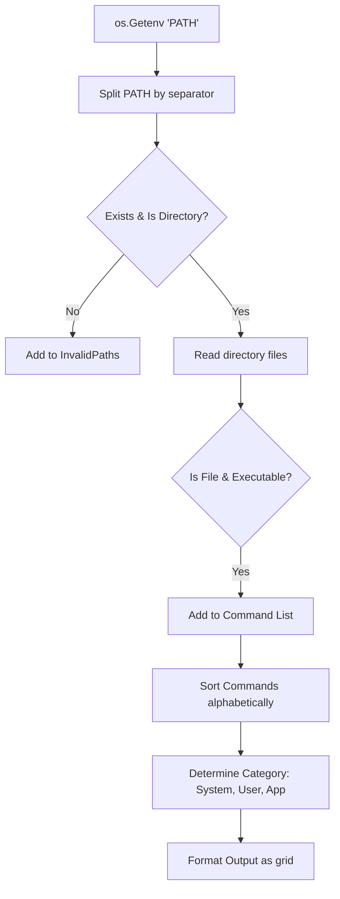

# Users Guide: pathcmds Reference Manual

This users guide provides a detailed reference for `pathcmds`, including its configuration, internal folder classification rules, subcommand options, and CLI flag reference.

---

## 1. Overview and Architecture

`pathcmds` operates by parsing the `$PATH` environment variable of the current shell session.



### Path Resolution
Each entry in `$PATH` is cleaned using `filepath.Clean` and converted to an absolute path using `filepath.Abs` before verification.
- **Symbolic Links**: `os.Stat` is used to check files, meaning symbolic links to directories are resolved to their targets.
- **Executable Bit**: A file is considered executable if it is a regular file and has at least one executable permission bit (`0111`) set in its file mode on Unix.

---

## 2. Category Classification Rules

When a directory path is successfully parsed, `pathcmds` classifies it into one of three categories: **System**, **User**, or **App**. This is handled by the `Categorizer` type.

Here is the exact precedence and pattern matching matrix used by the tool:

| Precedence | Category | Matching Rule / Pattern | Examples |
| :--- | :--- | :--- | :--- |
| **1** | **User** | Path contains the string `"homebrew"` (case-insensitive) | `/opt/homebrew/bin`, `/usr/local/Cellar/homebrew` |
| **2** | **App** | Path matches the App pattern regex **OR** starts with `/opt/` | `/opt/microsoft/powershell/bin`, `~/.cargo/bin`, `~/.dotnet/tools` |
| **3** | **System** | Path is equal to, starts with, or is inside `/bin`, `/sbin`, `/usr/bin`, `/usr/sbin`, or `/system` | `/bin`, `/usr/bin/custom`, `/system/bin` |
| **4** | **User** | Path contains `/usr/local`, `/opt/homebrew`, `/home/`, `/users/`, starts with `~`, or ends with `/bin`, `/sbin`, `/.local/bin` | `/usr/local/bin`, `/home/user/bin`, `/Users/alex/bin` |
| **5** | **User (Fallback)** | Any path that does not match the rules above | `/custom/deployment/path` |

### App Category Regex Pattern
The App category matches standard programming runtimes, SDKs, app bundles, and package-manager toolchains. The case-insensitive regex checks for:
- `.dotnet`
- `.cargo`
- `.rustup`
- `/go/bin`
- `.nvm`
- `.n/bin`
- `/node/`
- `pnpm`
- `yarn`
- `.rvm`
- `.pyenv`
- `/Library/Android/`
- `/Applications/`
- `/Library/Developer/`
- `/sdk/`
- `/toolchains/`
- `\.local/share/`
- `cellar`

---

## 3. CLI Command Reference

### Root Command: `pathcmds`
Displays all executables in the valid `$PATH` directories grouped and formatted.

**Usage:**
```bash
pathcmds [flags]
```

**Flags:**
* `-s, --system` (bool): Include system directories (`/bin`, `/usr/bin`, `/sbin`, `/usr/sbin`).
* `-u, --user` (bool): Include user directories (`/usr/local/bin`, Homebrew, home directories).
* `-a, --apps` (bool): Include app-specific directories (`.dotnet`, `.cargo`, `/opt/`, etc.).
* `-p, --page` (bool): Pipes the output into the `less -R` sub-process. If `less` is missing, it silently prints to stdout.
* `-h, --help` (bool): Display the help menu.
* `-v, --version` (bool): Display the version of the application.

---

### Subcommand: `pathcmds invalid`
Lists invalid, missing, or locked entries on the `$PATH`.

**Usage:**
```bash
pathcmds invalid [flags]
```

**Details Analyzed:**
- **Non-existent**: Path does not exist on the filesystem (`os.IsNotExist` returns true).
- **Not a directory**: The path exists but points to a regular file, pipe, or socket rather than a folder.
- **Inaccessible / Permission Denied**: The directory exists but the current user lacks permission to read its contents (e.g. read permission bit is unset or folder is locked).

---

### Subcommand: `pathcmds version`
Prints the application version.

**Usage:**
```bash
pathcmds version
```

**Output:**
```
pathcmds v1.0.0
```

---

## 4. Output Formatting & Layout

The grid formatting is calculated dynamically:
1. **Header Rendering**: Each directory prints a single colored header line:
   ```
   [PATH] [CATEGORY] ([COUNT] commands)
   ```
2. **Column Sizing**: The width of the columns is calculated as:
   `colWidth = maxCommandNameLength + 4 (padding spaces)`
3. **Number of Columns**: The number of columns is calculated relative to the detected terminal width:
   `numCols = terminalWidth / colWidth`
4. **Column-Major Ordering**: Commands are laid out column-by-column rather than row-by-row (matching standard `ls` behavior) for easier alphabetical readability downwards.

### Terminal Width Detection
The terminal width is queried in the following order of priority:
1. `term.GetSize` on `os.Stdout`
2. `term.GetSize` on `os.Stderr`
3. `term.GetSize` on `os.Stdin`
4. `COLUMNS` environment variable
5. Fallback Default: `80` characters
